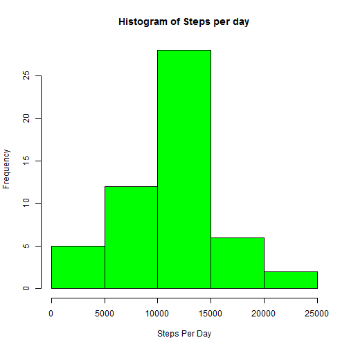
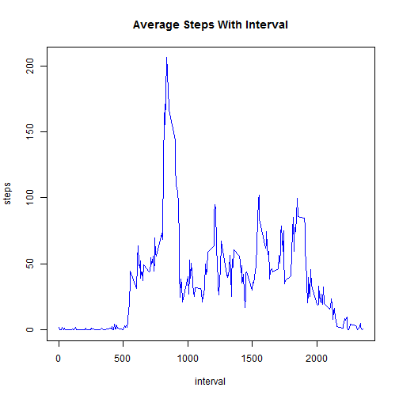
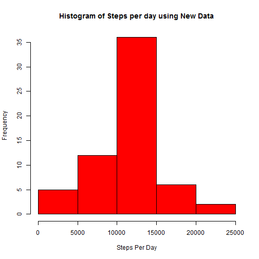

Peer Assignment 1
========================================================

## Loading and Preprocessing the data  
Setting the working directory and loading the data

```r
setwd("C:/Users/Rahul Agarwal/Desktop/UBUNTU/Data/Learning/Signature Track -Data Science/5. Assignments/Peer Assessment1")
activity_raw<-read.csv("activity.csv")
activity<-activity_raw[!is.na(activity_raw$steps),]
```

## What is mean total number of steps taken per day?  
We will first group by date column and store result in a variable called stepsPerDay.  
We will then use the variable to display the plot here and Then the mean and median.

```r
stepsPerDay<-aggregate(steps~date,activity,sum)
hist(stepsPerDay$steps,col='green',main='Histogram of Steps per day',xlab='Steps Per Day')
```

 

```r
mean_steps<-mean(stepsPerDay$steps)
median_steps<-median(stepsPerDay$steps)
```
The Mean Steps Taken Per Day is 1.0766 &times; 10<sup>4</sup> and the median of steps taken each day is 10765

## What is the average daily activity pattern?

```r
stepsPerInterval<-aggregate(steps~interval,activity,mean)
plot(stepsPerInterval,type="l",col='blue',main='Average Steps With Interval')
```

 

```r
interval_Max<-stepsPerInterval[stepsPerInterval$steps==max(stepsPerInterval$steps),]$interval
```
The Maximum steps have been taken in **Interval Number 835**

## Imputing missing values

```r
naCount<-sum(is.na(activity_raw$steps))
```

The Total number of missing values in the dataset is **2304**  
Imputing Missing Values using the mean for that 5-minute interval


```r
naData<-activity_raw[is.na(activity_raw$steps),][c("date","interval")]
naData_merged<-merge(x = naData, y = stepsPerInterval, by = "interval", all.x=TRUE)
fdata<-rbind(naData_merged,activity)
stepsPerDay2<-aggregate(steps~date,fdata,sum)
hist(stepsPerDay2$steps,col='red',main='Histogram of Steps per day using New Data',xlab='Steps Per Day')
```

 

```r
mean_steps2<-mean(stepsPerDay2$steps)
median_steps2<-median(stepsPerDay2$steps)
diffMean<-mean_steps2-mean_steps
diffMed<-median_steps2-median_steps
```
The Mean Steps Taken Per Day using new data is 1.0766 &times; 10<sup>4</sup> and the median of steps taken each day using new data is 1.0766 &times; 10<sup>4</sup>  
The Difference Between New Mean and Previous Mean is 0  
The Difference Between New Median and Previous Median is 1.1887  
The total daily number of steps have increased due to the imputation

## Are there differences in activity patterns between weekdays and weekends?


```r
library(lattice)
fdata$weekday<-as.factor(weekdays(as.Date(fdata$date)))
mapx<-data.frame(weekday=c('Sunday','Monday','Tuesday','Wednesday','Thursday','Friday','Saturday'),weekdayornot=c('Weekend','Weekday','Weekday','Weekday','Weekday','Weekday','Weekend'))
fdata_1<-merge(x=fdata,y=mapx,by="weekday",all.x=TRUE)
gdata<-aggregate(steps~interval+weekdayornot,fdata_1,mean)
xyplot(steps~interval | weekdayornot,data=gdata, layout = c(1, 2),type="l", xlab="Interval", ylab="Number of Steps", scales=list(cex=.8, col="black"))
```

 
The activity in later periods on weekend is considerably higher than later periods on weekdays.
